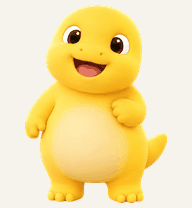
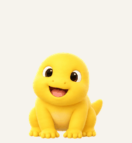
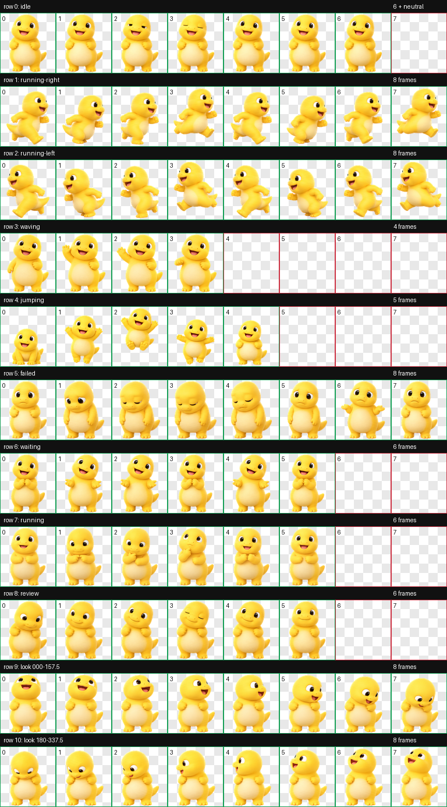

<div align="center">

# Nailong for Codex

**A little yellow companion for your next big idea.**

Nine animated states · Sixteen gaze directions · Transparent v2 spritesheet

**English** · [简体中文](README.zh-CN.md)

  

[Download](https://github.com/Yuyang-Song/nailong-codex-pet/releases/latest) · [Install](#install) · [Animations](#meet-your-companion) · [Contribute](docs/DEVELOPMENT.md)

</div>

Meet **奶龙 / Nailong**: a round, cheerful desktop companion with tiny arms and a very large belly. He blinks while you focus, thinks while tasks run, and looks expectant when it is your turn to respond.

This unofficial fan project packages an AI-generated interpretation of Nailong for desktop clients that support Codex custom pets. **No server, plugin, or API key is needed to use the pet.** Copy two files, choose Nailong, and get back to building.

## Install

### Download and copy — no coding required

1. Download **[`nailong.zip`](https://github.com/Yuyang-Song/nailong-codex-pet/releases/latest/download/nailong.zip)** from the latest release.
2. Unzip it and move the **`nailong` folder** into your Codex pets directory:

   ```text
   ~/.codex/pets/nailong/
   ├── pet.json
   └── spritesheet.webp
   ```

   On macOS, press **⌘⇧G** in Finder and enter `~/.codex/pets/`. Create the directory if needed. If you use a custom `CODEX_HOME`, use `$CODEX_HOME/pets/` instead.

3. Open **Settings → Mini & Pets** (called **Pets** in some versions), refresh the custom-pet list, and select **奶龙**. Restart the desktop app if it does not appear.

The ZIP also includes the license and artwork notice. Keep these when sharing the package. Only the two files inside `nailong/` are needed by the client.

> GIFs in this README are previews, not installable pets. The client needs the manifest and the complete WebP spritesheet. Avoid nesting the folder twice, such as `pets/nailong/nailong/pet.json`.

### Clone and install

Requires Git and Python 3.9+. The installer uses the Python standard library only.

```bash
git clone https://github.com/Yuyang-Song/nailong-codex-pet.git
cd nailong-codex-pet
python3 scripts/install.py
```

The installer respects `CODEX_HOME` and otherwise uses `~/.codex`. It copies only this pet's files; you select the pet in the app yourself.

```bash
# Use a different Codex data directory
python3 scripts/install.py --codex-home /path/to/codex

# Update an existing installation, preserving a backup first
python3 scripts/install.py --replace
```

An existing `nailong` installation is never overwritten by default. With `--replace`, the previous version is moved into `CODEX_HOME/pet-backups/`, and its location is printed.

**Compatibility:** this package's layout was checked against the macOS desktop client's local loader during creation. The client must support `spriteVersionNumber: 2`. Other platforms and future client versions have not been tested; settings labels can change. Installation was verified on disk, not through an automated in-app playback test.

## Meet your companion

| State | What you see | Frames |
| --- | --- | ---: |
| `idle` | Quiet breathing and a little blink | 6 |
| `running-right` | Alternating strides to the right | 8 |
| `running-left` | Matching strides to the left | 8 |
| `waving` | A small hello | 4 |
| `jumping` | Crouch, lift, airborne peak, and landing | 5 |
| `failed` | A disappointed look and a tiny shrug | 8 |
| `waiting` | Clasped hands, waiting for your response | 6 |
| `running` | Focused thinking while a task is active | 6 |
| `review` | A thoughtful lean, head tilt, and blink | 6 |
| Gaze | A clockwise circle from straight up | 16 |

The `running` state means **task processing**. Directional movement has its own two animation rows. The desktop client decides when each animation plays.

<details>
<summary>View the complete animation sheet</summary>



</details>

## Small package, inspectable files

```text
pet/nailong/          Install-ready manifest and spritesheet
docs/previews/       GIFs exported from the final spritesheet
docs/DEVELOPMENT.md  Atlas layout, workflow, and contributor guide
docs/PRIOR-ART.md    Dated research into earlier Nailong projects
scripts/install.py  Local installer with optional backup
scripts/assets.py   Validate, export previews, and build a release ZIP
qa/                 Validation and visual-review records without local paths
ASSETS.md           Artwork provenance and licensing scope
LICENSE             MIT license for original code and documentation
```

The final asset is a **1536 × 2288 RGBA WebP**, arranged in **8 columns × 11 rows** of **192 × 208** cells. The repository includes the finished raster asset and working utility source. It does not contain a 3D model, animation rig, or a deterministic recreation of the image-generation process.

### Quality checks

The release asset passed layout and transparency validation, edge cleanup, per-state visual inspection, and three independent blind gaze reviews. Checks also caught and fixed scale changes during extraction and a detached tail fragment in the mirrored run cycle. See the [QA records](qa/visual-review.json).

Known small differences: the rightward component at 22.5° is subtle, jumping is slightly smaller to leave room for vertical motion, and the two gaze-row boundaries have minor pose differences. These were reviewed and accepted; they are not claims of perfect motion or universal client compatibility.

## FAQ

**Nailong does not appear in the list.** Verify the directory above, check whether `CODEX_HOME` is customized, and confirm that `pet.json` points to `spritesheet.webp` with version `2`. Refresh or fully restart the app. An older client may not support this format.

**Can I rename him?** Change `displayName` in `pet.json`. To install two variants together, give the second variant a different folder name and `id` too.

**How do I uninstall or restore a backup?** Select another pet first, then move `pets/nailong/` out of the pets directory. To restore a backup made by the installer, move the saved folder from `pet-backups/` into `pets/` and name it `nailong`.

**Was this the first open-source Nailong pet?** No first-of-its-kind claim is made. Earlier public Nailong projects, including Codex v2 packages, already exist. Our [research notes](docs/PRIOR-ART.md) separate repository dates, license observations, and the limits of a web search.

## Related projects

Earlier community projects include [erich207/nailong-codex-pet](https://github.com/erich207/nailong-codex-pet) and [ZUNGJYU-dotcom/codex-nailong-pet](https://github.com/ZUNGJYU-dotcom/codex-nailong-pet). They offer other interpretations of the character. This repository was created independently and does not bundle their artwork or code. See the [research note](docs/PRIOR-ART.md) for additional projects and dated evidence.

## Contribute

Animation refinements, clearer setup instructions, and reports from other desktop versions are welcome. Include your OS, client version, installation method, and reproduction steps in an issue. Remove private information from screenshots. See the [development guide](docs/DEVELOPMENT.md) for asset validation and release commands.

## License and artwork

Original utility code and documentation are [MIT licensed](LICENSE). **Character artwork, names, trademarks, and other third-party rights are not included in that grant.** See [ASSETS.md](ASSETS.md) for AI-generation provenance and artwork limitations.

This is an independent fan project, not an official Nailong or OpenAI release. No affiliation or endorsement is implied.

---

<div align="center">May your builds be green and your little dragon stay cheerful.</div>
