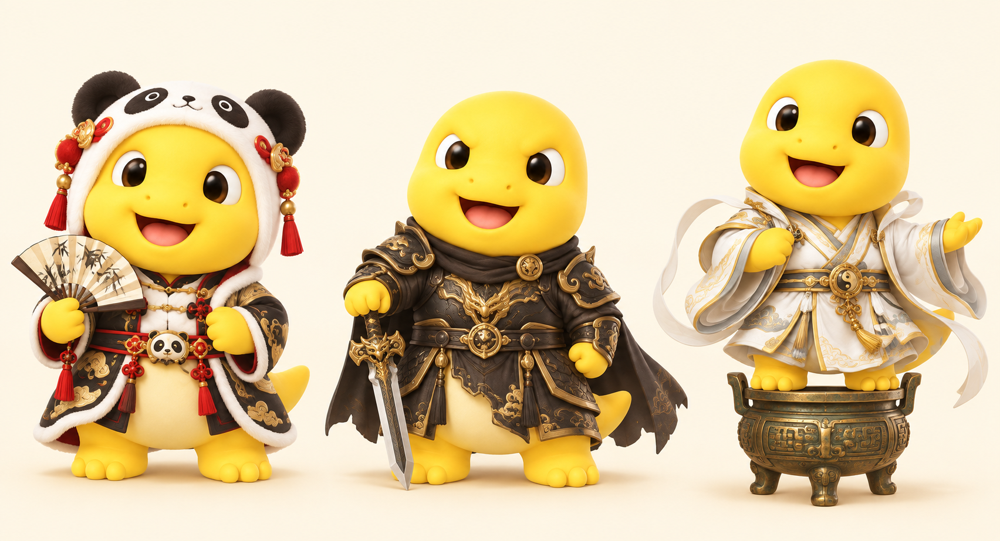

# Nailong wardrobe — design brief

[English README](../README.md) · [中文 README](../README.zh-CN.md)

## Available now

Only **Classic Nailong** (`nailong`) is a finished, installable skin. The installer can discover additional complete packages in `pet/<skin-id>/`, list their IDs with `--list`, and install one with `--skin <skin-id>`. Each package's manifest ID must match its directory name. Separate IDs allow skins to coexist; switching uses the desktop client's existing Pets list.

## Proposed outfits and motion

These are design proposals, not shipping features or official collaborations. Preserve Nailong's round body, yellow face, eyes, and proportions underneath the costume. Each released skin needs its own nine action loops and sixteen gaze poses, with attached props moving consistently.

| Direction | Costume idea | Proposed expressive motion | Status |
| --- | --- | --- | --- |
| Panda opera | Mengqi / Pang Da Rong Rong inspired panda hood and opera trim, with Nailong's yellow face visible | Fan greeting, rhythmic step, thoughtful fan-to-chin work pose | Concept exploration |
| Stern cultivator | Shi Hao / Perfect World inspired compact dark armor, restrained gold trim, attached cape and sword | Controlled sword salute, focused cultivation hand pose, grounded landing | Concept exploration |
| Cauldron rider | Ye Fan / Shrouding the Heavens inspired robes, feet planted on a compact three-legged bronze cauldron | Gentle cauldron bob, robe follow-through, concentrated hand seal | Concept exploration |
| “牛来的” | Exact meme/reference still to be identified | To be designed after reference confirmation | Awaiting reference |
| “牢大” | Basketball-themed Nailong if that is the intended meme; separate from the Honor of Kings theme | Ball-holding focus, greeting, compact celebratory jump | Awaiting clarification |

The cauldron should remain physically connected to the character silhouette. Effects, robes, swords, and props must fit at native pet size without clipping or obscuring gaze. Avoid detached particles and oversized effects that hide the expression.

## More motion within the client format

The current v2 atlas has fixed state rows and frame counts. Appending a tenth action row does not create a new client event. More variety means authoring new motion for a skin's existing semantic states, or shipping another complete animation variant. Idle remains quiet, working conveys active thought, waiting asks for attention, and review stays distinct. New app-triggered states would need client support beyond this asset repository.

## Release gate

A concept becomes an installable skin only after its complete atlas exists and passes layout, transparency, identity, motion continuity, and direction review. Generate documentation previews from the exact released asset. Keep unreleased concepts out of `pet/` so the installer cannot offer them as finished skins.

## Reference context

- [Honor of Kings official update: Mengqi and Pang Da Rong Rong](https://www.taptap.cn/moment/140920212215041591)
- [Perfect World official animation account: Shi Hao battle attire](https://weibo.com/7453780346/5171009100712504)
- [Shrouding the Heavens official animation feed](https://www.sina.cn/media/7661212901)

These references identify the requested themes; costume translations and motion proposals above are our design ideas. They do not establish official affiliation or asset permissions. See [ASSETS.md](../ASSETS.md).

## 中文说明

“奶龙衣柜”采用独立皮肤包：原版保留，新皮肤各有独立 ID，在客户端已有宠物列表里切换。目前仅原版可安装，表中的其他方向均未完成动画制作。

拟定三条造型路线：梦奇胖达荣荣方向的熊猫戏服、石昊方向的肃杀战甲、叶凡方向的脚踩万物母气鼎。它们都保留奶龙本体，并围绕服装和道具重新设计动作。“牛来的”需要具体梗图或参考链接；“牢大”需要确认是否指篮球梗，不归入王者荣耀角色。

客户端动作槽位固定，因此增加表现力要通过皮肤的完整动作变体实现，不能在图集后随意加行就声称客户端多了技能。每套皮肤完成全部动作、十六方向和检查后，才会出现在可安装列表中。

## Concept sheet / 造型草案

Left to right: panda opera, stern cultivator, cauldron rider. **Concept art only; none of these three is an installable animated skin yet.** The armor expression still reads cheerful; the next iteration should make it calmer and more severe. Detailed trims and flowing ribbons will need simplification at pet size.

从左到右：熊猫戏服、玄金战甲、白衣踏鼎。**当前仅为造型草案，不是可安装动画皮肤。** 战甲版表情还偏开心，后续应收敛为更沉静肃杀；服装纹饰和飘带在桌宠尺寸下需要简化。

Generated with the built-in image generation tool, using the original Nailong reference for identity. Visual brief: three separated full-body costumes on a warm cream background; preserve the same round yellow body, brown eyes, cream belly and toy-like shading. Panda hood and opera-inspired red/gold trim with a folding fan; compact dark iron/gold cultivation armor with short cape and downward sword; white/gold cultivator robes with both feet on a compact three-legged bronze cauldron. No logos, scene, particles, or text. This is a concept illustration, not an animation atlas.
